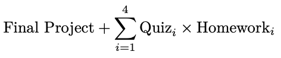

# **MAT 381E**

Welcome to my **Introduction to Data Science** class. I am going to share my lecture notes and HomeWork questions here.

# **Table of the Contents**

- [**MAT 381E**](#mat-381e)
- [**Table of the Contents**](#table-of-the-contents)
- [**Syllabus**](#syllabus)
  - [**Introduction to Data Science**](#introduction-to-data-science)
    - [**Course Description**](#course-description)
      - [**Course Textbooks**](#course-textbooks)
      - [**Some open data resources**](#some-open-data-resources)
      - [**Other Sources**](#other-sources)
      - [**Course Management**](#course-management)
    - [**E-Mail Policy**](#e-mail-policy)
    - [**Technical Requirements**](#technical-requirements)
    - [**Assessment**](#assessment)
      - [**Homeworks**](#homeworks)
      - [**Final Project**](#final-project)
    - [**Weekly Course Plan**](#weekly-course-plan)

# **Syllabus**
## **Introduction to Data Science**

- Lecture: MAT381E

- Date: Spring 2022

- Lecturer: Atabey Kaygun [(kaygun@itu.edu.tr)](mailto:kaygun@itu.edu.tr)

- Lectures Schedule: Mondays 14:30-17:30

### **Course Description**

Data science is a broad interdisciplinary field. It lies in the intersection of mathematics, statistics, and computer science and use their methods and tools to extract information and insight from data. This course is an introductory level data science course. We are going to introduce different data types (structured and unstructured) from different fields, and focus on importing, cleaning, reshaping, exploring, and visualizing data. The course aims to provide the students with basic knowledge on data science computational tools to interpret data from different disciplines.

#### **Course Textbooks**

- Zaki, M. J. and Meira, W. *Data Mining and Machine Learning: Fundamental Concepts and Algorithms* (2nd Ed.) Cambridge University Press, March 2020 ISBN: 978-1108473989. [[Available Online]](https://dataminingbook.info/book_html/)
- VanderPlas, J. T. *Python Data Science Handbook: Essential Tools for working with data.* O’Reilly. (2017). [\[Available Online\]](https://jakevdp.github.io/PythonDataScienceHandbook/)
- Rougier, N. *Scientific Visualization: Python + Matplotlib.* (2021) [hal-03427242] [\[Available Online\]](https://hal.inria.fr/hal-03427242)

#### **Some open data resources**

- [UCI datasets](https://archive.ics.uci.edu/ml/datasets.php)
- [Google dataset explorer](https://www.google.com/publicdata/directory)
- [Registry of open datasets on AWS](https://registry.opendata.aws/)
- [Open MRI, MEG, EEG, iEEG, and ECoG data](https://openneuro.org/)
- [NCBI datasets](https://www.ncbi.nlm.nih.gov/datasets/)
- [Open GIS data](https://www.usgs.gov/products/data-and-tools/gis-data)
- [NASDAQ data](https://data.nasdaq.com/search)

#### **Other Sources**

- Kaggle Courses on [Python,](https://www.kaggle.com/learn/python)[Pandas, ](https://www.kaggle.com/learn/pandas)[Visualization, ](https://www.kaggle.com/learn/data-visualization)[Data cleaning](https://www.kaggle.com/learn/data-cleaning) and [GIS Data](https://www.kaggle.com/learn/geospatial-analysis)

#### **Course Management**

I will make all of the course related announcement on İTÜ’s course management system [NINOVA](https://ninova.itu.edu.tr). I will post the grades on NINOVA as well. So, do check it regularly.

### **E-Mail Policy**

I receive approximately 50 e-mails per day. So, if you need to contact me, use the subject “MAT381E” in your e-mails. Spend some time structuring your e-mail with grammatically correct sentences in Turkish or in English. Be polite, direct, and concise. State what you need in the first two sentences. Sign your e-mails with your name and student number. If I can’t figure out who you are and what you need within 30 seconds of opening your message, I will delete your e-mail with no response. You are hereby warned.

### **Technical Requirements**

The course is an applied data analysis class. This means the course requires a degree of proficiency of computational tools from which you are going to be responsible.

- [git](https://git-scm.com/) and [GitHub](https://github.com/)
- [Python ](https://www.python.org)programming language (version 3.10 or higher)
- [Anaconda ](https://www.anaconda.com/)or [Pip](https://pypi.org/project/pip/) package managers
- [Jupyter](https://jupyter.org/) notebook system
- [Markdown](https://en.wikipedia.org/wiki/Markdown) markup language

Installing and maintaining these systems on your machine is your responsibility. I can’t help you if something doesn’t work. You will need to figure it out on your own. If you can’t install these systems on your machine you may try to use an online service:

- [Google Colab](https://colab.research.google.com/)
- [Microsoft Azure Notebooks](https://visualstudio.microsoft.com/vs/features/notebooks-at-microsoft/)
- [CoCalc](https://cocalc.com/)

### **Assessment**

Your performance is going to be judged via 4 homework assignments, 4 in-class quizzes and one final project. Each homework is 15 points, and each quiz is going to be valued between 0.0 and 1.0. Your total assessment for the course will be evaluated as follows:

If you miss any 2 of the quizzes or the homeworks you’ll get a VF. If your final is less than 25%, or your total is less than 35% you’ll receive an F.

---

|Assessment | Deadline |
| :-: | :-: |
|**GitHub Link**| Feb 28 |
|Homework 1 |March 14 |
|Quiz 1 | March 14 |
|Homework 2 | April 4 |
|Quiz 2 | April 4 |
|**Final Project Proposal** | April 11 |
|Homework 3 | April 25 |
|Quiz 3 | April 25 |
|Homework 4 | May 23 |
|Quiz 4 | May 23 |
|**Final Project** | May 30 |

---

There is no make-up for the quizzes or the homework. If you miss any of the quizzes, or the homework deadline because of an emergency, do contact me to make an arrangement as soon as you can.

#### **Homeworks**

For the homeworks, you are going to need to open a [GitHub](https://github.com) account and create a repository for this class. I am going to pull your howeworks and final project from your GitHub repositories at 11:59PM of each deadline date. You must send the link for the repository to my e-mail address with the subject “MAT381E GitHub Link” by Feb 28. The message should contain your full name, student number and the github link. If you do not follow these instructions, I will deduct upto 15 points from your final grade.

#### **Final Project**

The final project is worth 40 points and will be evaluated on your performance on your presentation, and your final project notebook. You may work with a team, but no larger than 3 students. You must open a separate repository with your team and submit the link via e-mail with the subject “MATH381E Final Project Link” by April 11th. In that proposal git repository, put a jupyter notebook with

- The title of the project
- The list of team members (names and student numbers)
- Project summary

At the end of the semester when you submit your final project, I will also want a short description of who did what for the final project as a supplement. Each team/student will present their final project to the whole class.

### **Weekly Course Plan**

The following is a tentative schedule of topics I am going to cover. I may go faster or slower depending on the week. I may even add new subjects, or even drop subjects depending on requests and participation. The quizzes will be given during the first 30 minutes of the allotted day, and I will do the lecture afterwards.

---

|**Week**|**Subject**|
| :-: | :-: |
|Feb 21|Data Science, Machine Learning, Statistics, Computer Science: Similarities and Differences.|
|Feb 28|**Deadline for GitHub link submission.**|
||Crash Course in Python and its Library Ecosystem.|
|Mar 7|Structured Data: CSV, JSON, XML and YAML|
||HW1|
|Mar 14|**Quiz 1 and Deadline for HW1.**|
||Open data sources, data APIs, and data scraping.|
|Mar 21|Basic visualizations: simple plots, scatter plots, histograms, heatmaps, bar and pie charts.|
|Mar 28|Unstructured data I: Image data.|
||HW2|
|Apr 4|**Quiz 2 and Deadline for HW2.**|
||Working with and visualizing high dimensional data: PCR and LDA.|
|Apr 11|**Final Project Proposals Due.**|
||More on working with high dimensional data.|
|Apr 18|Geospatial data and drawing maps.|
||HW3|
|Apr 25|**Quiz 3 and Deadline for HW3.**|
||More on geospatial data and maps.|
|May 2|Unstructured data II: Text data.|
|May 9|More on text data. NLP library eco-system.|
|May 16|Graphs and networks. Working with network data.|
||HW4|
|May 23|**Quiz 4 and Deadline for HW4.**|
||More on working with network data and visualizations.|
|May 30|**Final Project Due.**|

---

